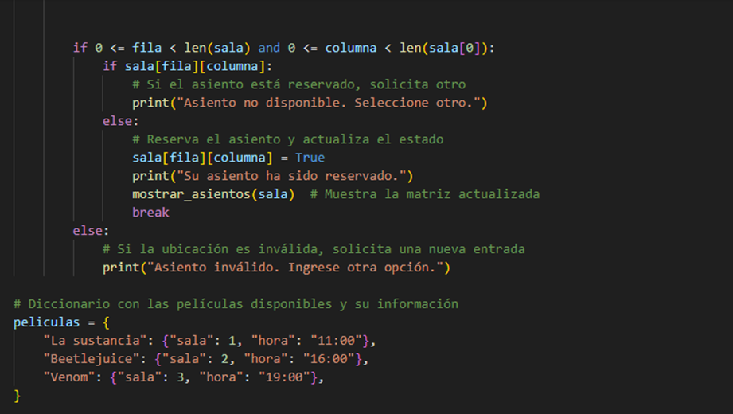
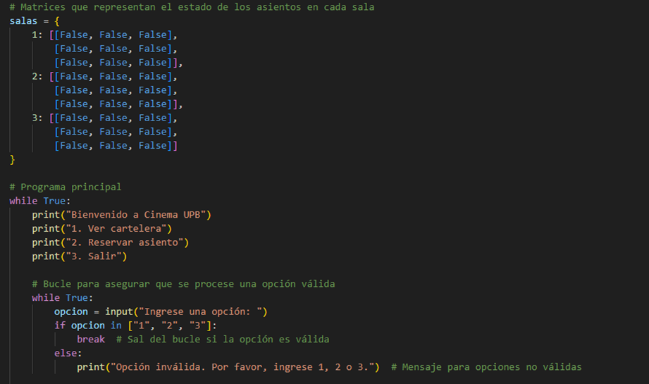

# Documentación del proyecto

Acá se pretende documentar el proceso de análisis y el paso a paso para la realización del código, también los inconvenientes presentados durante la elaboración de este. En el archivo README.md se documentó las generalidades y objetivos del programa. 

Para iniciar el proceso de la elaboración del código, inicialmente se empezará realizando por secciones para analizar cómo se utilizarían los elementos. 

1. Se hizo una función la cual mostrará los asientos disponibles y los asientos ocupados. Para esto se creo una función la cual muestre los asientos de la sala y se utilizó condicionales para indicarle al programa que símbolo mostrar si está ocupado o si está disponible. 
Esta función toma como entrada una lista de listas que representa los asientos, luego itera sobre cada fila y columna de la matriz, e imprime x si el asiento esta ocupado (valor True) o ✓ si está disponible (valor False). 
Para ver que la función si funciona se crea una matriz que representa la sala 1 y se ponen los valores True o False para que muestre la sala y la disponibilidad de los asientos. 
Sin embargo, aun el programa no funciona para que a medida que el usuario vaya ingresando las sillas vendidas se muestre la disponibilidad. Por el momento solo sirve para ver como se debería ver la sala a medida que se vayan vendiendo los asientos. 

 
2. Se creó una función para mostrar las opciones de la cartelera, dentro de esta función se creo un diccionario de películas en el cual está el nombre de la película, la hora y la sala. Luego se creó una función para poder seleccionar la película, en esta se utiliza la función anterior y se pide al usuario que ingrese el nombre de la película y devuelve el nombre de la película. 

 
3. Se creó una función que calcule el precio de la entrada según el horario de la película, esta función toma como entrada una cadena de texto que representa la hora de la película, extrae la hora y la convierte en numero entero para facilitar la comparación, hace las respectivas comparaciones y devuelve el valor calculado.

4. Se creó una función para reservar asientos, en este se muestra los asientos de la sala seleccionada y pide al usuario que ingrese el número de la fila y columna, valida si el asiento está disponible y actualiza la matriz si está libre. 

 
5. Una vez se crearon las funciones que se deben utilizar en el sistema de reservas de Cinema UPB, se debe crear un programa que integre todas estas. Inicialmente fue un poco complicado porque si bien ya estaban las funciones se debía encontrar la manera de que el programa pudiera hacer todo a la vez. 

6. Se probó cada función por separado para evidenciar que si realizara lo que se requería. Después de esto se creo un bucle en el cual si era True se ejecutara y mostrara un menú de opciones en el que de la bienvenida al cine, permita ver las opciones de película, pueda reservar asiento, o salir del programa. 

7. Cuando se empezó a escribir todo el código completo se presentaron algunos errores y es por esto que se tuvieron que hacer modificaciones en las funciones. Acá se realizó cambios en la función mostrar_asientos. 

8. En la función reservar_asientos se hicieron varias modificaciones en el bucle de modo que le dijera al usuario si el asiento estaba disponible para poder hacer la reserva o si ya no estaba disponible, también indicaba cuando era un asiento invalido o sea que no está dentro de la matriz. 

 
9. Ahora se escribió el código completo después de hacer modificaciones en las funciones, sin embargo sigue presentando errores, los cuales se identificaron haciendo pruebas de escritorio. El código inicialmente quedó así: 

10. Algunos de los errores que se presentan es que cuando se realiza la prueba de escritorio, se selecciona que se desea hacer una reserva, se selecciona la película, y apenas se hace la selección muestra los asientos disponibles en la sala, a veces así se seleccione un asiento que está disponible el programa muestra que no está disponible. Por lo tanto se debe revisar el código cuidadosamente para poder identificar donde se está presentando el problema. 

11. Realizando más pruebas de escritorio en ocasiones sale un error que dice que se presenta “IndexError: asignación a lista fuera del rango”. Esto pasa cuando se indica que la columna es 3, y este error se presenta con todas las películas. Todos estos errores presentados se están documentando con el fin de poder identificar en qué situaciones se están presentando errores. 

12. Uno de los cambios que se realizó fue que el usuario no tenga que ingresar el nombre de la película si no que ingrese un numero como opción y de esta manera se simplifica el uso del programa para el usuario. Para esto se modificó la función seleccionar_pelicula y se agregó el bloque de try y except para agregar excepciones. Esto lo que hace es que el try ejecuta un bloque y puede generar un error, si el código en el bloque try genera el error, pasa al bloque except donde se puede manejar el error. 

13. Aunque se han realizado cambios, el programa sigue presentando problemas en algunos asientos, por lo cual se sigue revisando detenidamente como solucionar ese error. 

14. Una vez, se realizó un análisis detallado del posible problema se llegó a la conclusión de que el programa si estaba cumpliendo su función si no que no estaba teniendo en cuenta que las posiciones de las filas y las columnas inician en 0 por lo que al no tener en cuenta esto creía que quedaba seleccionada el asiento incorrecto. 

15. Después de realizar cambios el programa quedó funcionando eficazmente ya que permite al usuario reservar el asiento, mostrar el valor de la función, y permite tener un control de reserva de asientos. 

16. Algunos de los cambios realizados para que el programa quedara funcionando bien es que se modificó la función mostrar_cartelera se utiliza la función enumerate que toma un iterable y devuelve un objeto enumerado (en este caso toma el resultado de peliculas.items()), se dice que inicie en 1, lo que indica que el primer elemento será el índice 1.
También, en el bucle for se usó index que es la variable que recibe el número de índice actual proporcionado por enumerate. Esto permite que cada película se numere automáticamente en la salida, haciendo mas fácil para el usuario seleccionar una opción. 
Al usar for (película, info) se está descomponiendo cada par en dos variables película (nombre de la película ) e info (el diccionario con detalles) 

Para poder implementar esto se utilizó como referencia la información obtenida en la siguiente página web: https://www.freecodecamp.org/espanol/news/enumerar-en-python-ejemplo-de-enumeracion-de-python-para-indice-de-bucle/

17. Otro de los errores que está presentando el código es que cuando se hace la prueba de escritorio se muestra lo siguiente: 

Está indicando opción invalida lo que indica que hay un error en la redacción del código. 

18. Se revisó el código nuevamente, y se corrigió. 

19. Finalmente ya se tiene el sistema de reservas de un cine, en el cual se pueden reservar asientos según la película, y se puede ver el precio de cada boleta. 

20. Finalmente el código quedó como se muestra a continuación: 

22. Si bien ya el código funciona bien, en las indicaciones de la evaluación se dice que el código debe seguir las convenciones de estilo de Python (PEP8) el cual utiliza nombres descriptivos para variables y funciones. 

23. Finalmente, en main.py se puede evidenciar el código completo con los requerimientos necesarios. 
