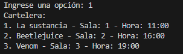
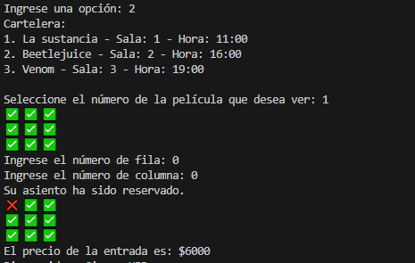
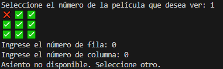
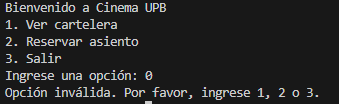

# Uso del programa

El programa es una simulación de un cine donde se puede ver la cartelera de películas y reservar asientos. Aquí se encuentran las posibles interacciones: 

1. Ver cartelera: Selecciona la opción 1 para mostrar la lista de películas disponibles, junto con sus salas y horarios.
2. Reservar asiento: Selecciona la copción 2 para elegir una película y reservar un asiento en la sala correspondiente. 
3. Salir: selecciona la opción 3 para salir del programa. 

### Opciones disponibles
1. Ver cartelera
2. Reservar asiento
3. Salir

#### Ejemplo de como se muestra el programa:

#### Al seleccionar la opción 1, el programa mostrará algo así: 

#### Al seleccionar la opción 2, y luego eliges la película, se te pedirá que elijas un asiento: 

Si el asiento está disponible, el programa confirmará la reserva. 

Nota: recuerde que las filas y las columnas van de 0 a 2

#### Para el manejo de errores: esto es en caso de que intente reservar un asiento que ya está reservado. 

#### Si intenta seleccionar una opción inválida:

##### Si tiene alguna duda del funcionamiento del programa comuníquese a +34 612 34 56 78 la cual es la línea a nivel nacional de software.desing y se le atendará lo más pronto posible.